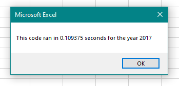

# Green Stocks Analysis 
## Overview/Purpose
### Goals

The two goals of this project were:

* Perform analysis on stock market data to determine the best performing **Green Energy** stocks over the years of 2017 and 2018 using a VBA macro.
* Take that VBA macro and refactor it for higher efficiency 
	* Efficiency measured via time to complete data collection and calculations within macro.
	* Specifically, for this challenge, the code needed to be refactored to loop through the data **one** time to collect the data.

The purpose for using a VBA macro and refactor it rather than entering formulas using `=` was so that it's easier for the end user to use and decreases the time/resources needed to calculate the results. Macros also allow for greater flexibility with a very small/no chance of the user accidently "breaking" the code like they could if they were to mistakenly delete any cell that contains formulas.

### Data and Analysis
I was provided with the data of 12 different green energy stocks for every market day for years 2017 and 2018. 

The data included:
* Ticker Symbol
* Date
* Opening Price
* Daily High
* Daily Low
* Closing Price
* Adjusted Closing Price
* Daily Volume

Since our analysis was to review which stocks were better investments options, annual returns and total volumes was calculated using the data from above. This is because these two metrics are some of the best and most simple indicators of stock performance. In addition, to enhance the results, returns were color coded to visualize which stocks produced positive and negative returns
to help the user see which stocks performed best.

## Results
### Analysis
The result from the analysis is shown in the images below
	

   

Based on these findings the best stock to invest in, based on both years of volume and returns, was **ENPH** with a cumulative return of **211.4%**!
	
### Refactoring
As described in the goals for the project, the macro used to calculated the results needed to be refactored. The challenge specifically asked to refactor the code so that it only needed to loop through the data once rather than multiple times.
	
Below is the code; the first is the original and the second is the refactored. Please note that code shared between the two (InputBox, Timer, Ticker Array, Formatting, etc.) has been excluded.
	
#### Original Code
````
    'Initializes variables for starting price and ending price
    Dim startingPrice As Single
    Dim endingPrice As Single
    
    'Activates data worksheet
    Worksheets(yearValue).Activate
    
    'Gets the number of rows to loop over
    RowCount = Cells(Rows.Count, "A").End(xlUp).Row

    'Loops through tickers
    For i = 0 To 11
        ticker = tickers(i)
        totalVolume = 0
        
    'Loops through rows in the data
        Worksheets(yearValue).Activate
        For j = 2 To RowCount
        
            'Gets total volume for current ticker
            If Cells(j, 1).Value = ticker Then
                totalVolume = totalVolume + Cells(j, 8).Value
            End If
            
            'Gets starting price for current ticker
            If Cells(j - 1, 1).Value <> ticker And Cells(j, 1).Value = ticker Then
                startingPrice = Cells(j, 6).Value
            End If
            
            'Gets ending price for current ticker
            If Cells(j + 1, 1).Value <> ticker And Cells(j, 1).Value = ticker Then
                endingPrice = Cells(j, 6).Value
            End If
            
        Next j
        
    'Outputs data for current ticker
    Worksheets("All Stocks Analysis").Activate
    Cells(4 + i, 1).Value = ticker
    Cells(4 + i, 2).Value = totalVolume
    Cells(4 + i, 3).Value = endingPrice / startingPrice - 1

   Next i
````
#### Refactored Code
````
    'Creates a ticker Index and initializes to zero
    tickerIndex = 0

    'Creates three output arrays
    Dim tickerVolumes(12) As Long
    Dim tickerStartingPrices(12) As Single
    Dim tickerEndingPrices(12) As Single

    'For loop to initialize the tickerVolumes to zero.
    'If the next row’s ticker doesn’t match, increase the tickerIndex.
    For i = 0 To 11
        tickerVolumes(i) = 0
        tickerStartingPrices(i) = 0
        tickerEndingPrices(i) = 0
    Next i

    'Loops over all the rows in the spreadsheet.
    'rowStart and rowEnd defined above
    For i = rowStart To rowEnd

        'Increase volume for current ticker
        tickerVolumes(tickerIndex) = tickerVolumes(tickerIndex) + Cells(i, 8).Value
    
        'Checks if the current row is the first row with the selected tickerIndex.
        If Cells(i, 1).Value = tickers(tickerIndex) And Cells(i - 1, 1).Value <> tickers(tickerIndex) Then
            tickerStartingPrices(tickerIndex) = Cells(i, 6).Value
        End If
    
        'Checks if the current row is the last row with the selected ticker
        If Cells(i, 1).Value = tickers(tickerIndex) And Cells(i + 1, 1).Value <> tickers(tickerIndex) Then
            tickerEndingPrices(tickerIndex) = Cells(i, 6).Value
        End If

        'Increases the tickerIndex.
        If Cells(i, 1).Value = tickers(tickerIndex) And Cells(i + 1, 1).Value <> tickers(tickerIndex) Then
            tickerIndex = tickerIndex + 1
        End If

    Next i

    'Loops through the ticker array to output the Ticker, Total Daily Volume, and Return.
    For i = 0 To 11
        Worksheets("All Stocks Analysis").Activate
        Cells(4 + i, 1).Value = tickers(i)
        Cells(4 + i, 2).Value = tickerVolumes(i)
        Cells(4 + i, 3).Value = tickerEndingPrices(i) / tickerStartingPrices(i) - 1
    Next i
````
As you can see in the two different code blocks, the main differences are:
* Added the `tickerIndex` and output arrays in place of variables for prices and volumes.
* Replaced nested loop with multiple single loops with If-Then statements to collect data, eliminating need to loop over already analyzed data

A timer was added to the code to track how long it took for the macros to run. Below are the images of times for both years using both the original and refactored code
##### Original Code Times

   

##### Refactored Code Times

   

## Summary
### Advantages and Disadvantages of Refactoring Code *in General*

The advantages and disadvantages of refactoring are debatable, but generally it's a good practice to refactor code since it makes it more clean and easier for others to read and interpret. It will take more time to complete the project that you have already completed, plus you add the risk of introducing errors and bugs while manipulating the code. The macro won't be ***more*** functional than before and the outcomes of it will not change, but it will be higher quality and more possibly efficient like in this project!

### Advantages and Disadvantages of Refactoring Code *in this Project*

The benefit of refactoring *this* code is that it takes out the need to do multiple loops of the same data. This significantly reduced the amount of time it took to collect data and calculate totals as evidenced by the times in the results section. The disadvantages of refactoring the code in this specific situation is that it did not reduce the size of the macro, but rather increased the size. The original code was a simpler method that accomplished the tasks required of it, and the refactored code is slightly longer and more complex.
